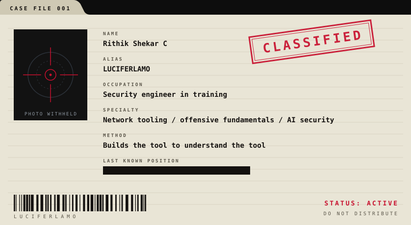
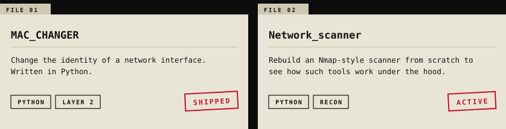
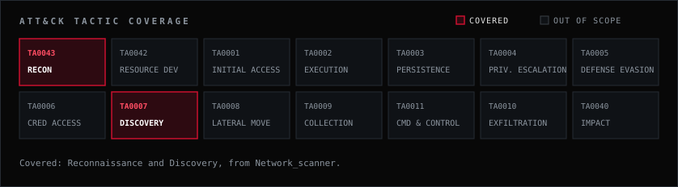

| Contract | Objective | Method | Status |
| --- | --- | --- | --- |
| [`MAC_CHANGER`](https://github.com/LUCIFERLAMO/MAC_CHANGER) | Change the identity of a network interface. | Python |  |
| [`Network_scanner`](https://github.com/LUCIFERLAMO/Network_scanner) | Rebuild an Nmap-style scanner from scratch. | Python |  |

